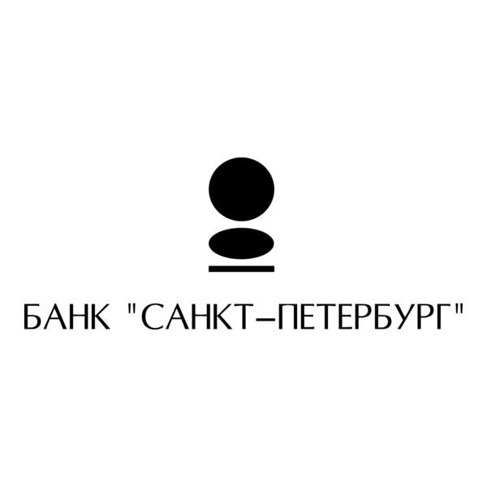

  

<h3 align="center">Hi, I'm Grigorii Sadovoi</h3>

  
  
  

---

### About me

  
  I am currently studying <b>Software Engineering</b> at
  <a href="https://en.itmo.ru/" target="_blank">ITMO University</a>, focusing on
  system and applied software engineering.

 

  
  I currently work as a DevOps Engineer at <b>Bank Saint Petersburg</b>, where I support
  infrastructure, write Ansible playbooks, and deploy new services.

 

I enjoy contributing to open source, shooting film photography, and constantly improving my engineering skills.

CV: [link](https://example.com/cv.pdf).

---

### GitHub stats

  
  

---

#### Where to find me

  
  
  

  

